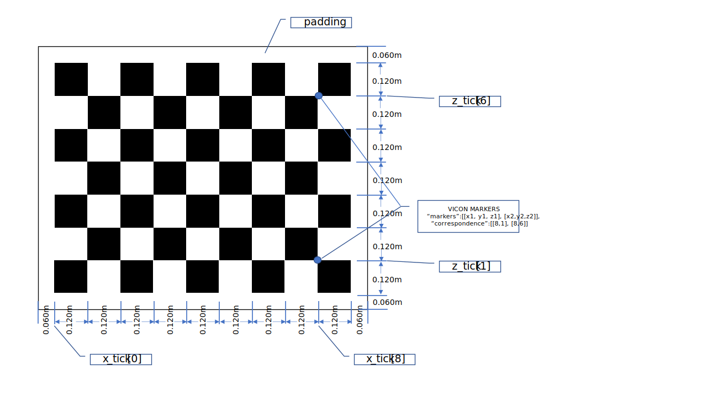

# Python Extrinsic Calibration
- [Python Extrinsic Calibration](#python-extrinsic-calibration)
  * [Installation](#installation)
  * [Input](#input)
  * [Usage](#usage)

## Installation

This software requires either Python 3.7 or Python 3.8 installed. (Python 3.9 not supported)
```bash
pip install -r requirements.txt
```

## Input
Each point cloud file should have one corresponding configuration file, and they should have the same name. For example, ```test.csv/test.pcap``` and ```test.json```. 
### 1. Point Cloud Files
Python code takes .csv files or .pcap file as input. CSV files can be converted from pcap files by cepton sdk.

### 2. Configuration Files
Configuration are saved in JSON files. The configuration info includes chessboard layout, measurement by VICON and a set of threshold. 

```
"boundary": [-2.5, 2.5, 2.3, 5.50, -0.4, 1.0, 0, 49.99],                          # A set of threshold to crop out the background
"chessboard": [                                                                   # [x_min, x_max, y_min, y_max, z_min, z_max, reflec_min, reflec_max]
  {                                                                               # <target layout>:
    "square_size": 0.120,                                                         # square size 
    "num_horizontal": 9,                                                          # number of squares in horizontal 
    "num_vertical": 7,                                                            # number of squares in vertical
    "padding": 0.06,                                                              # padding of the board
    "x_tick": [0, 0.12, 0.24, 0.36, 0.48, 0.60, 0.72, 0.84, 0.96, 1.08],          # refer to the image below
    "z_tick": [0, 0.12, 0.24, 0.36, 0.48, 0.60, 0.72, 0.84],                      # refer to the image below
    "measurement":{                                                               # <measurement from VICON>:
      "markers":[                                                                 # this should be the only thing that need to be copy pasted
        [6015.8696, 3219.1987, 1966.6748],                                        # Top-Left (TL) VICON measurement
        [6327.8794, 2183.5488, 1999.6848],                                        # Top-Right (TR) VICON measurement
        [6075.0894, 3205.1487, 1123.2048],                                        # Bottom-Left (BL) VICON measurement
        [6377.6694, 2168.629 , 1162.7648]                                         # Bottom-Right (BR) VICON measurement
      ],
      "correspondence":[                                                          # marker's corresponding index, [x_tick_index, z_tick_index]
        [0, 7],                                                                   # Top-Left (TL)
        [9, 7],                                                                   # Top-Right (TR)  
        [0, 0],                                                                   # Bottom-Left (BL)
        [9, 0]                                                                    # Bottom-Right (BR)
      ]
    }
  },
]
```




## Usage
### 1. Train
```bash
python main.py -f [TRAINING CSV/PCAP FILE] -m train
```

Extrinsic parameters will be saved as ```./output/[TRAINING CSV/PCAP FILE NAME]/parameters_for_VICON.json``` and ```./output/[TRAINING CSV/PCAP FILE NAME]/parameters_for_sensor.json```.

```parameters_for_VICON.json``` is for validation purpose only and ```parameters_for_sensor.json``` is the one that should be loaded into the sensor.

### 2. Validation
```bash
python main.py -f [VALIDATION CSV/PCAP FILE] -m validate --load_param ./output/[TRAINING CSV/PCAP FILE NAME]/parameters_for_VICON.json
```

### 3. Param-in-sensor Validation
After loading the ```parameters_for_sensor.json``` into the sensor. The result can be validated by the following command:
```bash
python main.py -f [PARAM-IN VALIDATION CSV/PCAP FILE] -m param-in --load_param ./output/[TRAINING CSV/PCAP FILE NAME]/parameters_for_sensor.json
```

### 4. Stand Alone Corner Extraction
This is for corner extraction only.

-f: The input file. <br>
-o: The output root directory. (Default: ```./output/```) <br>
--display: Display the corner plot. <br>

```bash
python corner_extraction.py -f /path/to/xxx.csv -o /directory/of/output/ --display
```
or
```bash
python corner_extraction.py -f /path/to/xxx.pcap -o /directory/of/output/ --display
```

All the output data will be saved under the ```/directory/of/output/xxx/```. 
